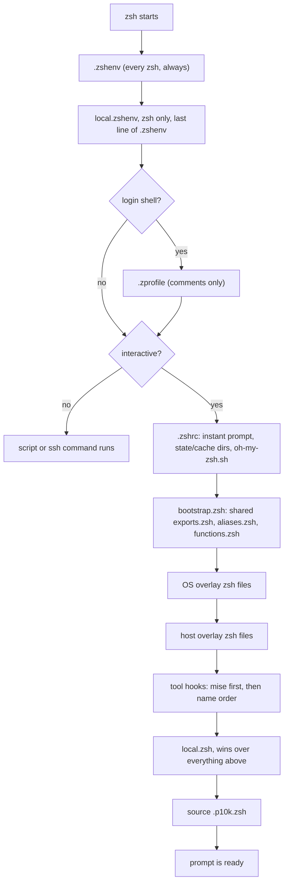

# Shell startup

How a shell gets from "zsh starts" to a prompt (or to a script's command running), what loads what, in what order, and what overrides what. Everything below is read straight from the code, with file and line citations so it can be checked against the source.

## 1. Which files run for which shell

zsh always reads `~/.zshenv` first, before anything else, from `$HOME` rather than `$ZDOTDIR`: `ZDOTDIR` is not set yet at that point (it is `.zshenv` itself that sets it), so this one file has to stay where zsh can find it without `ZDOTDIR` (`config/zsh/.zshenv` lines 1-2). Once `.zshenv` has run, every other startup file is looked up under `$ZDOTDIR`, which it set to `$XDG_CONFIG_HOME/zsh`, a directory link to `config/zsh/` (`config/zsh/.zshenv` lines 11-12, `config/links` line 11).

Which of the other files run depends on whether the shell is a login shell and whether it is interactive:

| Invocation | Example | Login? | Interactive? | Files read |
|---|---|---|---|---|
| A script | `zsh script.sh` | no | no | `~/.zshenv` only |
| An ssh command | `ssh host cmd` | no | no | `~/.zshenv` only |
| A terminal app | macOS Terminal, most terminal apps, opening a window or tab | yes | yes | `~/.zshenv`, then `$ZDOTDIR/.zprofile`, then `$ZDOTDIR/.zshrc` |
| A tmux pane | a new pane or window | depends on tmux's `default-command`/`default-shell` setup; usually yes | yes | usually the same three, `~/.zshenv`, `.zprofile`, `.zshrc` |
| A plain `zsh` | typing `zsh` inside another shell | no | yes | `~/.zshenv`, then `$ZDOTDIR/.zshrc` (no `.zprofile`) |

This repo keeps `.zprofile` deliberately empty, comments only (`config/zsh/.zprofile`), so for every row above the real work happens in `.zshenv` (always) and `.zshrc` (interactive only).

A tool that does not know about `$ZDOTDIR` writes its init lines straight into `~/.zprofile`, `~/.zshrc` or `~/.zlogin` in `$HOME`. Once `ZDOTDIR` points at `~/.config/zsh`, zsh never reads those `$HOME` copies again, so the tool's lines go nowhere. `scripts/install-dotfiles.sh`'s `migrate_legacy` leaves a real file like that exactly where it is rather than backing it up, since nothing here reads it from `$HOME` any more either way (`scripts/install-dotfiles.sh` lines 91-144, `legacy_leave_reason` says why for each name). A gitignored, machine-local `config/zsh/local.zshenv` is where the lines such a tool needs go instead: `config/zsh/.zshenv` sources it last, for every zsh (`config/zsh/.zshenv` lines 84-89, `overlays/README.md` lines 66-70, section 3 below).

## 2. The full chain



The same chain, as a tree, with the blocks inside each file in the order the code runs them:

```text
.zshenv                                (every zsh: a script, an ssh command, a login shell, an interactive shell)
  XDG_CONFIG_HOME, XDG_DATA_HOME, XDG_STATE_HOME, XDG_CACHE_HOME       (lines 5-9)
  ZDOTDIR=$XDG_CONFIG_HOME/zsh                                        (lines 11-12)
  skip_global_compinit=1                                              (lines 14-16)
  Homebrew's bin on PATH, for shells that never reach .zshrc          (lines 18-28)
  DOTFILES, DOTFILES_BIN, DOTFILES_CONFIG, DOTFILES_ZSH,
    DOTFILES_GIT, DOTFILES_OVERLAYS                                   (lines 30-36)
  DOTFILES_PRIVATE                                                    (lines 38-40)
  DOTFILES_HOST (short hostname, lower case, unless already set)      (lines 42-51)
  ZSH, ZSH_CUSTOM                                                     (lines 53-55)
  CARGO_HOME, RUSTUP_HOME, NPM_CONFIG_*, TMUX_PLUGIN_MANAGER_PATH,
    ZSHZ_DATA, DOCKER_CONFIG                                          (lines 57-66)
  CLAUDE_CONFIG_DIR, CODEX_HOME, GEMINI_CLI_HOME                      (lines 68-74)
  SHELL_SESSIONS_DISABLE=1                                            (lines 76-77)
  HISTFILE, ZSH_COMPDUMP (not exported)                               (lines 79-82)
  local.zshenv, zsh only, gitignored, last line of this file          (lines 84-89)
.zprofile                              (login shells only)
  kept empty, comments only                                           (whole file)
.zshrc                                 (interactive shells only)
  Powerlevel10k instant prompt                                        (lines 1-6)
  mkdir $XDG_STATE_HOME/zsh, $XDG_CACHE_HOME/zsh, $CODEX_HOME;
    HISTFILE set again                                                (lines 8-14)
  ZSH_THEME, oh-my-zsh's own updater disabled                         (lines 16-20)
  plugins=(docker docker-compose git gitfast npm tmux z
    zsh-autosuggestions zsh-syntax-highlighting)                      (lines 22-32)
  source $ZSH/oh-my-zsh.sh                                            (lines 36-37)
  source bootstrap.zsh                                                (lines 39-40)
    exports.zsh, aliases.zsh, functions.zsh (shared)                  (bootstrap.zsh lines 1-4)
    OS overlay: overlays/os/<os_id>/zsh/
      {exports,aliases,functions,extra,bootstrap}.zsh                 (bootstrap.zsh lines 19-20)
    host overlay: the same five files, host_overlay_dir()'s pick      (bootstrap.zsh lines 22-24)
    tool hooks: config/mise/init.zsh first, then every other
      config/<tool>/init.zsh in name order (atuin, brew, cargo,
      orbstack)                                                       (bootstrap.zsh lines 28-34)
    local.zsh, gitignored, wins over everything above                 (bootstrap.zsh lines 36-39)
  docker completion zstyle                                            (lines 42-43)
  source .p10k.zsh, if it exists                                      (lines 45-46)
```

## 3. Overlay resolution

An overlay is a directory of optional files for one OS or one host. `host_overlay_dir` (`scripts/utils/host.sh` lines 24-43) is the single place that decides which directory is "the overlay of this machine", and everything that reads a host overlay goes through it or `host_id`/`host_script`, which call it: the zsh loader (`config/zsh/bootstrap.zsh` line 24), `scripts/install-dotfiles.sh`'s `link_git_host` (lines 345-374), `scripts/install-packages.sh`'s `find_host_list` (lines 27-43), and `scripts/install.sh`'s `host_script` (lines 84-91). `migrate_legacy` (lines 108-144) and `config/zsh/.zshenv`'s `local.zshenv` read (lines 84-89) no longer go through a host overlay at all: the first only ever removes a link, and the second reads a plain machine-local file.

It takes the first of these two directories that exists, and does not merge the two: a private overlay missing a file does not fall back to the public one's copy of that file (`overlays/README.md` lines 20-28).

| Order | Directory | When it applies |
|---|---|---|
| 1 | `$DOTFILES_PRIVATE/<host>/dotfiles/` | the private overlays repo is checked out and has a folder for this host |
| 2 | `overlays/host/<host>/` | this repo has an overlay of that name |

`<host>` is the short hostname in lower case unless `DOTFILES_HOST` is exported, worked out the same way in `.zshenv` (lines 42-51) and in `host_id` (`scripts/utils/host.sh` lines 11-22). OS overlays have no such fallback chain: there is exactly one, `overlays/os/<os_id>/`, where `os_id` comes from `scripts/utils/os.sh`.

Which files inside an overlay get read, by what, and when:

| File | Read by | When |
|---|---|---|
| `zsh/exports.zsh`, `zsh/aliases.zsh`, `zsh/functions.zsh`, `zsh/extra.zsh`, `zsh/bootstrap.zsh` | `load_overlay` in `config/zsh/bootstrap.zsh` (lines 10-17) | interactive shells, after the shared files of the same names |
| `git/config` | `link_git_host` in `scripts/install-dotfiles.sh` (lines 345-374), host overlays only | the `dotfiles` install step, linked to `config/git/host` |
| `Brewfile`, `packages/pacman.txt`, `packages/apt.txt` | `find_host_list` plus `install_brew`/`install_pacman`/`install_apt` in `scripts/install-packages.sh` (lines 27-43, 78-213), host overlays only | the `packages` install step, after the shared list |
| `install.sh` | `host_script` in `scripts/install.sh` (lines 84-91) | the `host` install step, last |

`overlays/host/example/` has one line of each kind, commented out, as the documented shape; the real host overlays live only in the private repo (`overlays/README.md` lines 74-89).

## 4. What wins

Reading further down the chain in section 2 means overriding what came before, for everything except git settings, which have their own chain (section 5). Earliest to latest, in general: a shared file, then an OS overlay, then a host overlay, then a tool hook, then `local.zsh`. Variables have two more override points around that chain: `local.zshenv`, the last line of `.zshenv` itself, can already change a value `.zshenv` just set, before `.zprofile`, `.zshrc` or `bootstrap.zsh` run at all; for an interactive shell, `local.zsh` at the very end still wins over everything, `local.zshenv` included.

| What | Earliest to latest | Concrete example |
|---|---|---|
| A variable | shared `.zshenv` → `local.zshenv` (still inside `.zshenv`) → shared `exports.zsh` (via `bootstrap.zsh`) → OS overlay `exports.zsh` → host overlay `exports.zsh` → tool hook → `local.zsh` | `CARGO_HOME` defaults to `$XDG_DATA_HOME/cargo` at `config/zsh/.zshenv` line 58; `config/zsh/local.zshenv`, sourced at `.zshenv` lines 84-89, can set it again before any other file even runs (`config/zsh/local.zshenv.example` line 18 shows the shape, commented out), and `config/zsh/local.zsh` can still override that for an interactive shell, last of all |
| An alias | shared `aliases.zsh` → OS overlay `aliases.zsh` → host overlay `aliases.zsh` → `local.zsh` | the shared `config/zsh/aliases.zsh` defines no `install`, `up` or `cleanup`; each OS overlay's `zsh/aliases.zsh` adds its own, loaded after the shared file by `bootstrap.zsh` line 20 (`overlays/os/macos/zsh/aliases.zsh` lines 2-8 vs. `overlays/os/debian/zsh/aliases.zsh` lines 2-9) |
| A function | shared `functions.zsh` → OS overlay `functions.zsh` → host overlay `functions.zsh` → `local.zsh` | `e` and `mkd` are defined in the shared `config/zsh/functions.zsh` (lines 2-15); a host overlay's `zsh/functions.zsh`, loaded after the shared one by `bootstrap.zsh` line 24, could redefine either (`overlays/host/example/zsh/functions.zsh` line 1 shows the shape; real host overlays are private, so this repo has no live example) |
| A git setting | `config/git/config` → `config/git/host` include → `config/git/local` include | the default identity (`user.name`, `user.email`, `user.signingkey`) is set at `config/git/config` lines 1-4; `config/git/local`, included last at `config/git/config` lines 156-158, overrides it, which `config/git/local.example` lines 3-5 states directly |
| A tool's spot on `PATH` | `.zshenv`'s early Homebrew prepend → shared `exports.zsh`'s prepends → tool hooks, in hook order (`mise` first, then name order) | `config/zsh/.zshenv` lines 20-28 put Homebrew's `bin` on `PATH` for every zsh; `config/brew/init.zsh` runs the full `brew shellenv` again later for interactive shells and then `typeset -U path` (lines 2-7), which keeps the newest copy of a duplicated entry, so Homebrew's `bin` ends up ahead of the mise shims that `config/mise/init.zsh` (first among the hooks, `bootstrap.zsh` line 30) had just put on `PATH` |

## 5. Git config chain

Git's own order still applies underneath this: a system config, then the global one, then the repository's `.git/config`, then the command line, each later one overriding the earlier for a setting both touch. This repo only controls the global one. Git uses `$XDG_CONFIG_HOME/git/config` as the global config when `~/.gitconfig` does not exist, and `~/.config/git` is a directory link to `config/git/` (`config/links` line 14), so that global config is `config/git/config`, tracked in this repo.

| Order | File | Tracked? | Set here |
|---|---|---|---|
| 1 | `config/git/config` | yes | shared defaults: identity, aliases, colors, delta, `init.defaultBranch` (lines 1-150) |
| 2 | `config/git/host` (`[include] path = ~/.config/git/host`) | no, a symlink, gitignored | per-host settings; the link itself is made by `link_git_host` (`scripts/install-dotfiles.sh` lines 345-374) to the host overlay's `git/config`, when it has one |
| 3 | `config/git/local` (`[include] path = ~/.config/git/local`) | no, gitignored | the per-machine identity, copied by hand from `config/git/local.example` |

Both includes are at the end of `config/git/config` (lines 152-154 and 156-158), in that order, and a missing include path is silently skipped (the comment at line 152). Because `local` is included last, it overrides both the shared defaults and the host include for anything both set, which `config/git/local.example` lines 3-5 says directly: "git applies includes last, so anything set here wins over the defaults baked into the tracked config (name, email, signing key)."

## 6. The installer

`scripts/install.sh` runs nine steps in the order of its `STEPS` table (lines 15-25), each skippable with its own `DOTFILES_SKIP_*` variable, or selected on its own with `--only <step>`. `OPTIONAL_STEPS` (line 28) lists the five that only warn on failure and let the run carry on; the rest stop the run.

| Step | Skip variable | Reads | Touches network | On failure |
|---|---|---|---|---|
| `private` | `DOTFILES_SKIP_PRIVATE` | `DOTFILES_PRIVATE_REPO`, clones or pulls to `DOTFILES_PRIVATE` (`scripts/install-private.sh`) | yes | warns |
| `packages` | `DOTFILES_SKIP_PACKAGES` | `packages/{Brewfile,apt.txt,pacman.txt,aur.txt}`, plus the host overlay's `Brewfile`/`packages/apt.txt`/`packages/pacman.txt` (`scripts/install-packages.sh` lines 27-213) | yes | stops the run |
| `dotfiles` | `DOTFILES_SKIP_DOTFILES` | `config/links` and the host overlay's `git/config` (`scripts/install-dotfiles.sh`) | no | stops the run |
| `shell` | `DOTFILES_SKIP_SHELL` | `config/zsh/.zshenv` (sourced to resolve paths), clones oh-my-zsh, Powerlevel10k, the two zsh plugins, tpm (`scripts/install-shell.sh` lines 19-48) | yes | stops the run |
| `mise` | `DOTFILES_SKIP_MISE` | `config/mise/config.toml` (`scripts/install-mise.sh`) | yes | warns |
| `ai-clis` | `DOTFILES_SKIP_AI_CLIS` | `config/zsh/.zshenv` (sourced), the vendor installers of claude, codex, gemini (`scripts/install-ai-clis.sh`) | yes | warns |
| `nvim` | `DOTFILES_SKIP_NVIM` | `~/.config/nvim`, already linked (`scripts/install-nvim.sh`) | yes | warns |
| `os-defaults` | `DOTFILES_SKIP_OS_DEFAULTS` | `os/<id>.sh`, chosen by `os_defaults_script` (`scripts/install.sh` lines 75-81) | no | stops the run |
| `host` | `DOTFILES_SKIP_HOST` | the host overlay's `install.sh`, found by `host_script` (`scripts/install.sh` lines 84-91) | depends on that script | warns |

`private` runs first so the machine's overlay is in place for every step after it (`scripts/install.sh` line 57 of `usage`). `--dry-run` (`DOTFILES_DRY_RUN=1`) makes every step print what it would do and change nothing; `--yes` (`DOTFILES_YES=1`) skips the confirmation a real run asks from a terminal.

## 7. Where do I put a new line?

- Needed by every shell, including a script or an ssh command, for all machines, and it is only an environment setting (no output): `config/zsh/.zshenv`, shared.
- Every shell, this machine only: `config/zsh/local.zshenv` (copy `config/zsh/local.zshenv.example`; gitignored, sourced last by `.zshenv` itself, wins over everything else `.zshenv` sets, including the shared file).
- Needed only by interactive shells, for all machines (an alias, a function, a `setopt`, a completion tweak): `config/zsh/{exports,aliases,functions}.zsh`.
- Needed by all machines running one OS: `overlays/os/<id>/zsh/{exports,aliases,functions,extra,bootstrap}.zsh`.
- Needed by one host, and worth sharing or scripting: the private overlays repo's `<host>/dotfiles/`, or `overlays/host/<host>/` in this repo if it is fine to be public.
- Needed by this machine only, interactive shells, and never meant to be committed: `config/zsh/local.zsh` (copy `config/zsh/local.zsh.example`; gitignored, sourced last, wins over everything else, `local.zshenv` included). A per-machine git identity is `config/git/local` the same way.
- A secret (a token, a private hostname, an address of a private repo): never in this repo, tracked or not. It belongs in `local.zsh`, `local.zshenv`, `config/git/local`, or the private overlays repo, whichever already applies above.
